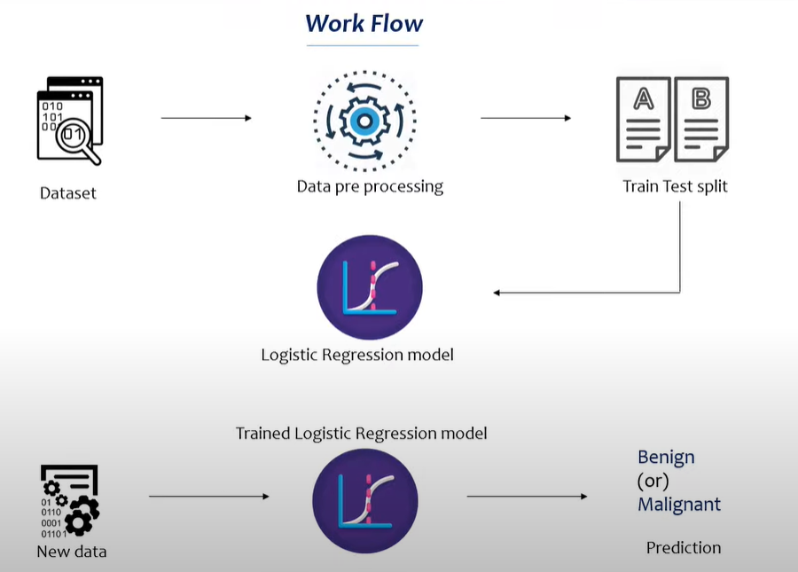

# **Introduction**

In this project we basically try to find weather a tumor is Banign or Malignant based on the data from fine needle aspiration test.

As we have to find between 2 labels i.e. Binary classification we can use **Logistic Regression**.

# **Workflow**

