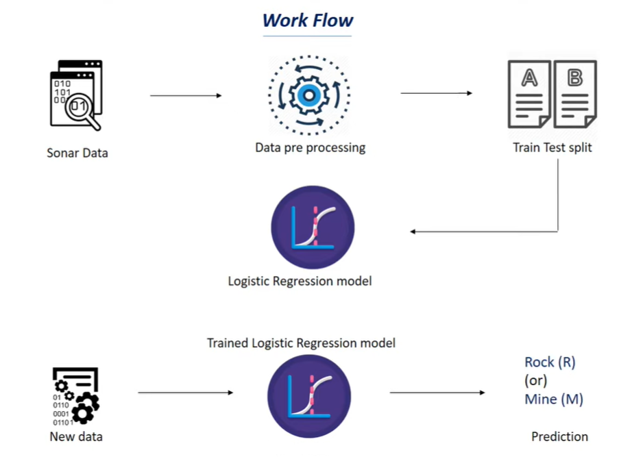

# **Introduction**

In this project we basically try to find weather an object is Rock or Mine based on the data from sonar waves.

As we have to find between 2 labels i.e. Binary classification we can use [**Logistic Regression**](../../Machine%20Learning%20Models/Logistic%20Regression.md).

# **Workflow**

